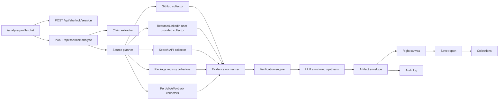

# Sherlock Evidence Verification Workspace - Execution Plan

Date: 2026-06-17
Target route: `/analyse-profile`
Existing app: Next.js 16, React 19, Supabase helpers, existing `/analyse-profile` demo UI, existing `/student/collections` page, existing server-only OpenAI/GitHub utilities.

## 1. Product Goal

Build Sherlock as an evidence-only verification workspace for recruiters/founders. The left side is a persistent chat intake surface. The right side is a live canvas that renders evidence dossiers, infographics, claim maps, source timelines, GitHub depth analysis, contradiction cards, interview handoff packs, and saved reports.

Sherlock must never produce an overall candidate score, rank, reject recommendation, or merit judgment. Its output is limited to:

- `verified`: an artifact supports the claim.
- `contradicted`: an artifact conflicts with the claim.
- `unverified`: no artifact currently supports or conflicts with the claim.
- `needs_alternative_proof`: the claim may be true but public evidence is missing or inaccessible.

The system is a corroborate / contradict / route engine. It is not a truth oracle and it is not an automated shortlisting engine.

## 2. Non-Negotiable Guardrails

1. No score, percentile, rank, fit label, thumbs-up/down, hire/no-hire, or hidden scoring field.
2. No autonomous rejection, down-ranking, or merit conclusion.
3. LinkedIn, Glassdoor, Crunchbase, Stack Overflow, package registries, and search engines must be accessed only through permitted APIs, user-provided exports, user-pasted content, or compliant public endpoints. Do not build unauthorized scraping against services that prohibit bots or automated access.
4. Every claim state must include traceable evidence or an explicit reason why no evidence was found.
5. Every report must include a human decision area that is separate from Sherlock output.
6. Store raw source snapshots, normalized evidence, model prompts, model outputs, and human decisions in an audit log.
7. Treat private repos and missing public evidence as `needs_alternative_proof`, never as negative evidence.
8. Fraud signals must be phrased as "signals consistent with..." or "requires human review", not definitive accusations.
9. PII controls are mandatory: retention settings, delete/export, access control, audit history, and source redaction.

## 3. Current Repo Baseline

Useful existing files:

- `app/analyse-profile/page.tsx`: existing Sherlock-style split UI with chat left and proof profile canvas right.
- `components/SherlockChatPanel.tsx`: existing chat panel component.
- `components/CandidateProofProfile.tsx`: existing right-canvas proof profile component.
- `app/student/collections/page.tsx`: existing collection UI reading saved items from local storage.
- `lib/github.ts`: existing GitHub user/repo fetcher and normalization helper.
- `app/api/github/route.ts`: existing GitHub route.
- `app/api/portfolio/extract/route.ts`: existing portfolio extraction route.
- `app/api/resume/extract-text/route.ts`: existing resume text extraction route.
- `lib/openai.ts` and `lib/llm/providers.ts`: existing server-only model helper/fallback patterns.
- `supabase/migrations/0001_init.sql`: existing DB migration pattern.

Main change strategy: evolve the current demo into a real server-backed workspace instead of replacing it.

## 4. Target User Experience

### Left Panel: Chat Intake

The recruiter can type any of:

- Candidate name: `Kumar Dhananjaya Shivanna`
- GitHub URL: `https://github.com/username`
- LinkedIn URL: `https://www.linkedin.com/in/...`
- Resume text or uploaded PDF
- Portfolio URL
- Package URL: npm, PyPI, crates.io
- Role or JD text
- Company context
- Free-form question: `Check whether the Go experience is real`

The chat continues as context grows. Sherlock asks only for missing context that materially affects verification:

- "Which role should I scope this against?"
- "Do you have a resume or LinkedIn export?"
- "Do you have permission to access this LinkedIn profile through an approved source?"
- "GitHub public evidence is thin. Route to work sample or reference?"

### Right Canvas: Live Evidence Artifacts

The right pane should switch between artifact views:

- `Overview`: candidate identity card, verification state counts, source freshness, warnings.
- `Claim Matrix`: every claim from resume/LinkedIn/application with state and evidence links.
- `GitHub Depth`: authored commits, repo ownership, fork/vendor filtering, cadence, language-by-authored-code, tutorial/noise indicators.
- `Timeline`: education, titles, employment dates, commits, packages, talks, papers, public artifacts.
- `Contradictions`: direct conflicts with artifacts and suggested interview probes.
- `Alternative Proof`: work sample, live task, reference request, private repo attestation.
- `Interview Pack`: contradiction-driven questions and proof requests.
- `Evidence Dossier`: source list, snapshots, citations, artifact hashes, model trace.

### Top Save Button

Add a persistent Save button above the right canvas. Saving creates a collection item and navigates or makes available under a new collection tab/page:

- Preferred first implementation: persist to Supabase table `sherlock_saved_reports`.
- Temporary development fallback: persist to localStorage under `sherlock-saved-reports-v1`, then merge into `/student/collections`.
- Add a filter tab in `/student/collections`: `Sherlock Reports`.

## 5. Architecture

Use a server-orchestrated workflow. The browser should never call third-party APIs directly and should never hold API keys.



## 6. Source Policy

### Allowed In MVP

- Uploaded resume/PDF/text from the user.
- User-pasted LinkedIn text or LinkedIn data export.
- GitHub public API and optional user/token-authenticated GitHub API.
- Public portfolio URLs using the existing URL extraction route, with SSRF protections.
- Package registries:
  - npm registry API.
  - PyPI JSON API.
  - crates.io API.
  - GitHub releases/packages where public.
- Search APIs with explicit paid/free API terms:
  - Brave Search API, Bing Web Search, Google Programmable Search, SerpAPI, or Tavily.
- Internet Archive Wayback CDX API for historical page existence.
- arXiv, Semantic Scholar, Crossref, ORCID where relevant.

### Not Allowed Without Explicit Partner/API Permission

- Automated LinkedIn scraping.
- Automated Glassdoor scraping.
- Automated Crunchbase scraping unless using the approved Crunchbase API or licensed provider.
- Circumventing robots.txt, rate limits, login walls, anti-bot controls, or paywalls.
- Inferring protected attributes or sensitive personal traits.

### Source Reliability Labels

Each evidence artifact gets a source type and reliability label:

- `primary_artifact`: Git commit, package release, authored paper, personal website page, public repo.
- `self_reported`: resume, LinkedIn, application form.
- `third_party_context`: company profile, funding/stage data, conference listing.
- `model_inferred`: LLM extraction from text. Must never stand alone as verification.
- `untrusted_search_hit`: search snippet. Must be fetched and normalized before use.

## 7. Data Model

Add a Supabase migration after MVP UI is planned.

Tables:

### `sherlock_sessions`

- `id uuid primary key`
- `owner_user_id uuid nullable`
- `candidate_display_name text nullable`
- `target_role text nullable`
- `status text check in ('draft','collecting','analyzing','ready','failed')`
- `created_at timestamptz`
- `updated_at timestamptz`

### `sherlock_messages`

- `id uuid primary key`
- `session_id uuid references sherlock_sessions(id)`
- `sender text check in ('user','sherlock','system')`
- `content text`
- `attachment_json jsonb`
- `created_at timestamptz`

### `sherlock_claims`

- `id uuid primary key`
- `session_id uuid`
- `claim_type text check in ('identity','stack','tenure','title','scope','education','project','package','publication','company_context','other')`
- `claim_text text`
- `claim_subject text nullable`
- `normalized_json jsonb`
- `source text`
- `created_at timestamptz`

### `sherlock_evidence`

- `id uuid primary key`
- `session_id uuid`
- `source_type text`
- `source_name text`
- `source_url text nullable`
- `retrieved_at timestamptz`
- `artifact_date timestamptz nullable`
- `artifact_hash text nullable`
- `raw_snapshot_ref text nullable`
- `normalized_json jsonb`
- `reliability text`

### `sherlock_verifications`

- `id uuid primary key`
- `session_id uuid`
- `claim_id uuid references sherlock_claims(id)`
- `state text check in ('verified','contradicted','unverified','needs_alternative_proof')`
- `summary text`
- `supporting_evidence_ids uuid[]`
- `contradicting_evidence_ids uuid[]`
- `reasoning_json jsonb`
- `human_review_required boolean default true`
- `created_at timestamptz`

### `sherlock_reports`

- `id uuid primary key`
- `session_id uuid`
- `title text`
- `artifact_envelope jsonb`
- `share_token text nullable`
- `created_at timestamptz`

### `sherlock_saved_reports`

- `id uuid primary key`
- `owner_user_id uuid nullable`
- `report_id uuid references sherlock_reports(id)`
- `title text`
- `summary text`
- `tags text[]`
- `saved_at timestamptz`

### `sherlock_audit_log`

- `id uuid primary key`
- `session_id uuid`
- `actor_type text check in ('system','user','model','collector')`
- `event_type text`
- `event_json jsonb`
- `created_at timestamptz`

## 8. API Routes

Create these routes under `app/api/sherlock`.

### `POST /api/sherlock/session`

Creates or updates a chat session.

Input:

```json
{
  "sessionId": "optional",
  "message": "candidate input or instruction",
  "attachments": []
}
```

Output:

```json
{
  "sessionId": "uuid",
  "assistantMessage": "What role should I scope this against?",
  "nextActions": []
}
```

### `POST /api/sherlock/extract-claims`

Extracts zero-trust claims from resume, pasted LinkedIn, application form, and user-provided text.

### `POST /api/sherlock/collect`

Runs allowed collectors based on a source plan:

- GitHub.
- Portfolio URL.
- Package registries.
- Search API.
- Wayback.
- Uploaded docs.

### `POST /api/sherlock/analyze`

Runs claim extraction, source planning, evidence collection, verification, and artifact generation.

### `POST /api/sherlock/save`

Saves the current artifact envelope to `sherlock_saved_reports`.

### `GET /api/sherlock/reports/:id`

Fetches a saved report for reopening in the right canvas.

## 9. Core Engine Modules

Create these server modules:

- `lib/sherlock/types.ts`: canonical TypeScript types.
- `lib/sherlock/schemas.ts`: Zod schemas for claims, evidence, verification, artifact envelope.
- `lib/sherlock/claim-extractor.ts`: deterministic + LLM claim extraction.
- `lib/sherlock/source-planner.ts`: decides which collectors are allowed and useful.
- `lib/sherlock/collectors/github.ts`: commit/repo/language/depth analysis.
- `lib/sherlock/collectors/packages.ts`: npm/PyPI/crates package ownership/release checks.
- `lib/sherlock/collectors/search.ts`: search API wrapper with rate limits and snapshots.
- `lib/sherlock/collectors/portfolio.ts`: wrapper around existing portfolio extraction.
- `lib/sherlock/collectors/wayback.ts`: historical page existence.
- `lib/sherlock/evidence-normalizer.ts`: maps raw artifacts to canonical evidence.
- `lib/sherlock/verification-engine.ts`: deterministic corroborate/contradict/neither logic.
- `lib/sherlock/llm-synthesis.ts`: structured report generation only after evidence is normalized.
- `lib/sherlock/audit.ts`: audit event writer.
- `lib/sherlock/save-report.ts`: collection persistence.

## 10. GitHub Depth Analysis

Do not trust repo-level language percentages by themselves. Build author-level signals.

MVP GitHub steps:

1. Normalize username using existing `lib/github.ts`.
2. Fetch user and repos.
3. Exclude forks by default but show them in a separate section.
4. For each candidate-owned repo:
   - Fetch commits through GitHub API.
   - Match commits by GitHub author login where possible.
   - Record commit date, repo, message, verification status, additions/deletions if available.
   - Fetch languages endpoint for repo-level context, but label it as repo-level only.
5. For stronger analysis, add shallow clone in a controlled worker:
   - Run `git log --author` with email/name aliases.
   - Run `git blame` on selected files to estimate authored code.
   - Detect vendored/generated directories.
6. Detect noise:
   - Fork-only activity.
   - Tutorial repo names/readme patterns.
   - One-day commit bursts.
   - Massive initial import with no later evolution.
   - Generated files dominating changes.
   - README-only portfolios.

Output must be evidence phrased:

- "Public GitHub evidence supports regular TypeScript authorship from Jan 2024 to May 2026."
- "The Go claim is contradicted by available public GitHub evidence: only one forked Go repo and no authored Go commits found."
- "Private company code may exist. Route Go claim to live task or reference."

## 11. Claim Verification Rules

### Stack Claims

Strongly verifiable from authored code, package ownership, talks, papers, and project artifacts.

State examples:

- `verified`: authored code and package history show the claimed stack over time.
- `contradicted`: claimed stack is absent while another stack dominates and the only evidence is forked/tutorial material.
- `unverified`: no public code and no alternative artifacts.
- `needs_alternative_proof`: private work likely, ask for work sample/reference/private repo walkthrough.

### Tenure / Timeline Claims

Bracketable and contradiction-catchable.

Signals:

- Claimed role dates.
- Education dates.
- GitHub first public activity.
- Package releases.
- conference/paper dates.
- Company stage/date context.

Important: absence of public code before a date is not proof by itself. Use contradiction only when dates are impossible or materially conflicting.

### Title Claims

Mostly unverifiable externally. Only catch contradictions.

Example:

- "Staff Engineer at Stripe" with no public Stripe artifacts = `unverified`, not negative.
- Conflicting public bio/date/company artifact = `contradicted`.

### Scope / Impact Claims

Hardest to verify. Corroborate where possible, otherwise route.

Signals:

- Repo ownership and multi-contributor patterns.
- Architecture docs/blogs/talks.
- Package adoption.
- Company size/stage context.
- Public case studies.

Never claim "did not lead" based only on no public proof. Say "leadership scope is unverified; route to reference or interview probe."

## 12. Identity and Fraud Signals

Identity continuity should compare public handles and user-provided artifacts:

- Name variants.
- Avatar/photo consistency where user has permission to process it.
- Email domains from commits, if public.
- Profile URLs from resume.
- Timezone/activity pattern only as a weak signal.
- Cross-linked GitHub, portfolio, package registry, papers, talks.

Fraud and impersonation signals:

- Resume claims a GitHub handle but the profile name/email/history conflicts.
- Repos show copied projects with no evolution.
- Commit timestamps and author metadata look fabricated or bulk imported.
- Claimed seniority conflicts with artifact complexity and timeline.
- Interview identity does not match submitted evidence, to be handled by human review.

Output language:

- Allowed: "High-risk identity continuity issue: GitHub account email/name does not match the submitted resume, and no cross-link was found."
- Not allowed: "This candidate is a fraud."

## 13. JD-Scoped Verification

The JD is used only to decide which claims require evidence. It is not used to rank the candidate.

For each role:

- Parse must-have requirements.
- Generate a must-have evidence checklist.
- Map claims and artifacts to those requirements.
- Produce a role-scoped gap report.
- Route missing evidence to alternative proof.

Example:

```json
{
  "requirement": "Production Go services",
  "requiredEvidence": ["authored Go repo", "package/service ownership", "work sample", "reference"],
  "state": "needs_alternative_proof",
  "reason": "Public GitHub did not show authored Go services; private work may exist."
}
```

## 14. Artifact Envelope

Use a single normalized artifact envelope for the right canvas.

```ts
type SherlockArtifactEnvelope = {
  artifactType: "sherlock_evidence_report"
  version: "1.0"
  sessionId: string
  generatedAt: string
  candidate: {
    displayName?: string
    handles: Array<{ source: string; value: string; url?: string; confidence: "high" | "medium" | "low" }>
  }
  targetRole?: string
  summary: {
    verified: number
    contradicted: number
    unverified: number
    needsAlternativeProof: number
    humanReviewRequired: true
  }
  claims: SherlockClaim[]
  evidence: SherlockEvidence[]
  verifications: SherlockVerification[]
  contradictionCards: ContradictionCard[]
  interviewPack: InterviewQuestion[]
  proofRoutes: AlternativeProofRoute[]
  auditRefs: string[]
  prohibitedOutputsAbsent: {
    noScore: true
    noRanking: true
    noAutoReject: true
  }
}
```

## 15. OpenAI / LLM Usage

Use LLMs for extraction and synthesis, not as the source of truth.

Recommended server pattern:

- Move new work to the OpenAI Responses API or current server-side OpenAI SDK wrapper when implemented.
- Use structured outputs with JSON schema for claim extraction, source planning, and report synthesis.
- Keep all provider calls server-side.
- Temperature low (`0` to `0.2`).
- Validate every model output with Zod.
- If schema validation fails, retry once with a repair prompt, then fail safely.
- Never let the model invent evidence. Evidence IDs must come from normalized collectors.

### System Prompt: Claim Extractor

```text
You are Sherlock Claim Extractor. Extract self-reported candidate claims from user-provided text only.

Rules:
- Treat resume, LinkedIn, and application text as zero-trust claims, not evidence.
- Do not verify anything.
- Do not infer protected attributes.
- Do not score or rank the candidate.
- Return only claims that are explicitly stated or strongly implied by the text.
- Preserve exact source snippets.
- Output valid JSON matching the provided schema.
```

### System Prompt: Source Planner

```text
You are Sherlock Source Planner. Given claims and allowed connectors, choose which evidence collectors should run.

Rules:
- Use only allowed sources listed in the source policy.
- Do not request unauthorized scraping.
- LinkedIn content can be used only if user-provided, exported by the user, or accessed through an approved API.
- For each collector, explain which claims it can corroborate or contradict.
- Prefer primary artifacts over search snippets.
- Output valid JSON matching the provided schema.
```

### System Prompt: Verification Synthesizer

```text
You are Sherlock Verification Synthesizer. You receive claims and normalized evidence artifacts.

Rules:
- You may only cite evidence IDs that are present in the input.
- Assign each claim one state: verified, contradicted, unverified, or needs_alternative_proof.
- Never create an overall score, rank, fit label, hire/no-hire recommendation, or rejection recommendation.
- Absence of public evidence is not negative evidence.
- For contradictions, explain the exact artifact conflict.
- For unverified claims, propose a human proof route.
- Generate concise interview questions only from contradictions or missing proof.
- Output valid JSON matching the provided schema.
```

### System Prompt: 90-Second Report

```text
You are Sherlock Report Writer. Produce a human-auditable verification report.

Rules:
- Evidence-only language.
- No merit judgment.
- No candidate score.
- No ranking.
- No autonomous decision.
- Every factual statement must reference evidence IDs.
- Include "What is verified", "What is contradicted", "What remains unverified", and "Recommended proof route".
- End with "Human decision required".
```

## 16. UI Implementation Plan

### `/analyse-profile`

Refactor current page into:

- `app/analyse-profile/page.tsx`: server shell if needed.
- `app/analyse-profile/SherlockWorkspace.tsx`: client controller.
- `components/sherlock/SherlockChat.tsx`: left chat.
- `components/sherlock/SherlockCanvas.tsx`: right artifact host.
- `components/sherlock/SherlockTopBar.tsx`: save, export, source status.
- `components/sherlock/artifacts/ClaimMatrix.tsx`.
- `components/sherlock/artifacts/GitHubDepth.tsx`.
- `components/sherlock/artifacts/Timeline.tsx`.
- `components/sherlock/artifacts/ContradictionBoard.tsx`.
- `components/sherlock/artifacts/InterviewPack.tsx`.
- `components/sherlock/artifacts/EvidenceDossier.tsx`.

Layout:

- Left: fixed 400-440px chat panel.
- Right: `minmax(0, 1fr)` canvas.
- Save button top-right of the canvas.
- Use tabs/icons for artifact views.
- Keep dense, operational UI. Avoid marketing hero sections.

### Collections

Update `/student/collections`:

- Add `CollectionKind = "profile" | "job" | "roadmap" | "sherlock_report"`.
- Add filter `Sherlock Reports`.
- Load local fallback key `sherlock-saved-reports-v1`.
- Later replace local fallback with Supabase saved reports.
- Card action opens `/analyse-profile?reportId=...` or `/sherlock/reports/[id]`.

## 17. Phased Execution

### Phase 0: Lock Scope and Remove Risky Language

Goal: Update plan, define no-score rule, and list allowed sources.

Deliverables:

- `plan.md`.
- Product rule: no score/ranking/reject.
- Source policy documented.

Codex prompt:

```text
Read plan.md and the existing Sherlock files. Do not implement yet. Summarize the existing files that can be reused and list any code paths that currently use scoring/ranking language that must not leak into Sherlock.
```

Acceptance:

- Plan exists.
- Any old "score" or "fit ranking" UI is explicitly excluded from Sherlock.

### Phase 1: Types, Schemas, and Mock Artifact UI

Goal: Build the contract before connecting APIs.

Deliverables:

- `lib/sherlock/types.ts`.
- `lib/sherlock/schemas.ts`.
- Mock `SherlockArtifactEnvelope`.
- Right canvas renders all artifact tabs from mock data.
- Save button stores mock report to localStorage and appears in collections.

Codex prompt:

```text
Implement Phase 1 from plan.md. Add Sherlock TypeScript types and Zod schemas, create a mock artifact envelope, refactor /analyse-profile so the left chat remains and the right canvas can render Overview, Claim Matrix, GitHub Depth, Timeline, Contradictions, Interview Pack, and Evidence Dossier from the mock envelope. Add a Save button that saves to localStorage under sherlock-saved-reports-v1 and update /student/collections with a Sherlock Reports tab. Do not add scoring, ranking, or reject recommendations.
```

Acceptance:

- `/analyse-profile` loads with mock artifact tabs.
- Save persists a report.
- `/student/collections` shows saved Sherlock report.
- `npm run build` passes or existing unrelated failures are documented.

### Phase 2: Session and Audit Backend

Goal: Make chat and reports server-backed.

Deliverables:

- Supabase migration for Sherlock tables.
- `POST /api/sherlock/session`.
- `POST /api/sherlock/save`.
- Audit writer.
- Client uses session ID.

Codex prompt:

```text
Implement Phase 2 from plan.md. Add Supabase tables for sherlock_sessions, sherlock_messages, sherlock_reports, sherlock_saved_reports, and sherlock_audit_log. Add server routes for session creation/message append and report save. Keep a localStorage fallback if Supabase env is missing. Add tests for schema validation and no-score output constraints.
```

Acceptance:

- Session messages persist when Supabase is configured.
- Save persists server-side when possible and falls back locally when not.
- Audit events are written for user message, analysis start, collector run, model call, report save.

### Phase 3: Claim Extraction

Goal: Convert resumes, LinkedIn exports/pastes, and application text into zero-trust claims.

Deliverables:

- `POST /api/sherlock/extract-claims`.
- Claim extractor deterministic pre-parser.
- LLM structured extractor.
- Resume text route integration.
- UI shows extracted claims before verification.

Codex prompt:

```text
Implement Phase 3 from plan.md. Build a claim extraction route and lib/sherlock/claim-extractor.ts. Use existing resume text extraction where possible. Treat all user-provided text as self-reported claims. Use structured JSON output and validate it with Zod. Add UI state showing extracted claims as unverified until evidence collection runs.
```

Acceptance:

- Pasting resume text produces claim cards.
- Uploading PDF extracts text then claims.
- Claims include type, text, source snippet, normalized dates/stack when available.
- No claim is marked verified by extraction alone.

### Phase 4: GitHub Collector and Depth Analysis

Goal: Verify stack/project claims with GitHub public evidence.

Deliverables:

- `lib/sherlock/collectors/github.ts`.
- Repo ownership/fork separation.
- Commit cadence.
- Author match.
- Repo language context.
- Initial noise indicators.
- GitHub Depth canvas.

Codex prompt:

```text
Implement Phase 4 from plan.md. Extend the existing GitHub utilities into a Sherlock collector. Fetch user, repos, commits, repo languages, and separate owned repos from forks. Build commit cadence and authored evidence artifacts. Do not use repo language percentages as proof by themselves; label them repo-level context. Render GitHub Depth in the right canvas and add tests for username normalization, fork filtering, and evidence state mapping.
```

Acceptance:

- GitHub URL or username can be attached in chat.
- Public repos and commits become evidence artifacts.
- Forks are shown separately.
- Stack claims can be verified/contradicted only through explicit evidence rules.

### Phase 5: Source Planner and Multi-Source Collection

Goal: Expand beyond GitHub without unauthorized scraping.

Deliverables:

- Source planner.
- Search API wrapper.
- Package registry collectors.
- Wayback collector.
- Portfolio collector integration.
- Source status UI.

Codex prompt:

```text
Implement Phase 5 from plan.md. Add a source planner that maps claims to allowed collectors. Add collectors for npm, PyPI, crates.io, Wayback, search API, and portfolio URLs. All collectors must record source URL, retrieval timestamp, source type, reliability, raw snapshot reference when available, and normalized evidence JSON. Add rate limit and timeout handling. Do not implement LinkedIn scraping; only accept user-provided LinkedIn text/export or approved API data.
```

Acceptance:

- Portfolio/package/search evidence appears in Evidence Dossier.
- LinkedIn URL without approved source prompts for paste/export/API permission.
- Collector failures degrade gracefully and become audit events.

### Phase 6: Verification Engine

Goal: Deterministically map claims to states.

Deliverables:

- `lib/sherlock/verification-engine.ts`.
- Stack, tenure, title, scope rule modules.
- Contradiction cards.
- Alternative proof routes.

Codex prompt:

```text
Implement Phase 6 from plan.md. Build a verification engine that maps claims and evidence to verified, contradicted, unverified, or needs_alternative_proof. Keep rules deterministic where possible and use LLM only for synthesis. Add unit tests for stack claims, title claims, tenure contradictions, scope claims, and private-repo alternative proof routing. Enforce no score/ranking/reject fields in schemas and tests.
```

Acceptance:

- Example "Expert Go, 5 years" with no authored Go evidence and only a forked tutorial repo is contradicted with evidence IDs.
- "Staff at private company" with no public artifacts is unverified or needs alternative proof, not contradicted.
- Interview questions are generated from contradiction/gap reasons.

### Phase 7: LLM Synthesis and 90-Second Report

Goal: Convert verified data into human-readable reports.

Deliverables:

- `lib/sherlock/llm-synthesis.ts`.
- Structured report schema.
- 90-second report view.
- Interview pack view.
- Share/export view.

Codex prompt:

```text
Implement Phase 7 from plan.md. Add LLM synthesis that receives only normalized claims, evidence, and verification states. Use structured output and Zod validation. The model may summarize but may not create new evidence. Add the 90-second report, contradiction-driven interview pack, and shareable evidence report UI. Include tests that fail if output contains score, rank, hire, reject, pass, fail, or unsupported evidence IDs.
```

Acceptance:

- Report cites evidence IDs.
- No unsupported factual claims.
- No score/ranking/recommendation language.
- Human decision required is visible.

### Phase 8: Compliance, Privacy, and Trust Controls

Goal: Make the system usable in hiring contexts without hidden risk.

Deliverables:

- Candidate disclosure template.
- Data retention setting.
- Delete/export report.
- Audit log view.
- Admin source policy page.
- Redaction for sensitive fields.

Codex prompt:

```text
Implement Phase 8 from plan.md. Add compliance and trust controls: audit log view, candidate disclosure template, delete/export saved report, source policy copy, and redaction utilities for sensitive fields. Ensure every report shows evidence-only output and human decision required. Do not add automated rejection or scoring.
```

Acceptance:

- Report can be exported with audit references.
- Report can be deleted.
- Candidate disclosure artifact is generated.
- Audit trail shows source, time, collector, model prompt version, and human notes.

### Phase 9: Production Hardening

Goal: Make it robust enough for real usage.

Deliverables:

- Queue/background jobs for slow collection.
- Rate limit per user/session.
- Collector timeout budget.
- Source cache.
- SSRF protection.
- Observability.
- Evals.

Codex prompt:

```text
Implement Phase 9 from plan.md. Add production hardening: source fetch timeouts, SSRF URL validation, per-user rate limits, collector cache, background job support for slow collectors, structured logging without secrets, and eval fixtures for no-score/no-rank behavior. Keep all third-party calls server-side.
```

Acceptance:

- Malicious URLs are blocked.
- API keys never reach client bundle.
- Slow collectors do not freeze UI.
- Evals cover at least 20 claim/evidence scenarios.

## 18. Environment Variables

Add to `.env.example` later:

```bash
OPENAI_API_KEY=
OPENAI_MODEL=
GITHUB_TOKEN=
BRAVE_SEARCH_API_KEY=
BING_SEARCH_API_KEY=
SERPAPI_API_KEY=
TAVILY_API_KEY=
CRUNCHBASE_API_KEY=
LINKEDIN_APPROVED_API_KEY=
SHERLOCK_ENABLE_WEB_SEARCH=false
SHERLOCK_ENABLE_APPROVED_LINKEDIN_API=false
SHERLOCK_RETENTION_DAYS=30
```

Only enable source connectors when a key and policy approval exist.

## 19. Testing Strategy

Unit tests:

- Claim extraction schema validation.
- Source planner allowed/disallowed sources.
- GitHub username normalization.
- Fork filtering.
- Verification state rules.
- No prohibited output fields.
- Evidence ID citation validation.

Integration tests:

- Resume upload -> claims -> unverified states.
- GitHub URL -> evidence -> GitHub Depth canvas.
- Save report -> Collections tab.
- LinkedIn URL without approved API -> asks for paste/export, does not scrape.
- Search API disabled -> source planner skips web search.

UI tests:

- `/analyse-profile` desktop split layout.
- Mobile fallback layout.
- Save button visible and stable.
- Artifact tabs do not overflow.
- Right canvas renders nonblank states.

Evals:

- Stack contradiction case.
- Private repo engineer case.
- Fabricated timeline case.
- Strong public artifact case.
- Same-name identity ambiguity case.
- Package ownership case.
- Conference talk corroboration case.

## 20. Risks and Mitigations

Risk: Unauthorized scraping creates legal/platform risk.
Mitigation: source policy, connector allowlist, LinkedIn paste/export/API only.

Risk: User treats Sherlock as a hiring decision engine.
Mitigation: no score, no ranking, human decision required, proof-route framing.

Risk: Model hallucinates evidence.
Mitigation: normalized evidence IDs, structured schema, citation validation, reject unsupported output.

Risk: Public evidence penalizes private-repo engineers.
Mitigation: `needs_alternative_proof` state and work sample/reference routing.

Risk: Identity/fraud flags become accusations.
Mitigation: cautious language, human review, evidence links, no definitive labels.

Risk: PII retention.
Mitigation: retention controls, deletion/export, audit access, minimal snapshots.

Risk: GitHub author matching is imperfect.
Mitigation: show confidence, use GitHub login linkage where possible, avoid overclaiming.

## 21. Primary Documentation References

- OpenAI Structured Outputs: https://developers.openai.com/api/docs/guides/structured-outputs
- OpenAI Function Calling: https://developers.openai.com/api/docs/guides/function-calling
- GitHub REST commits API: https://docs.github.com/en/rest/commits/commits
- GitHub REST search API: https://docs.github.com/en/rest/search/search
- LinkedIn User Agreement: https://www.linkedin.com/legal/user-agreement
- EU AI Act official text: https://eur-lex.europa.eu/legal-content/EN/TXT/?uri=CELEX:32024R1689

## 22. Definition of Done

Sherlock is complete when:

1. A recruiter can paste a candidate name/resume/GitHub/portfolio/JD into `/analyse-profile`.
2. Sherlock extracts claims and collects allowed evidence from multiple sources.
3. The right canvas displays a claim-level evidence dossier with infographics.
4. Every claim is `verified`, `contradicted`, `unverified`, or `needs_alternative_proof`.
5. The report includes contradiction-driven interview questions.
6. The Save button adds the report to Collections.
7. Audit logs exist for source collection, model synthesis, and human actions.
8. No output or database field creates an overall score, rank, auto-reject, or hire/no-hire recommendation.
9. LinkedIn and similar sources are handled only through approved APIs, user-provided data, or compliant exports.
10. Tests and evals enforce evidence-only behavior.
